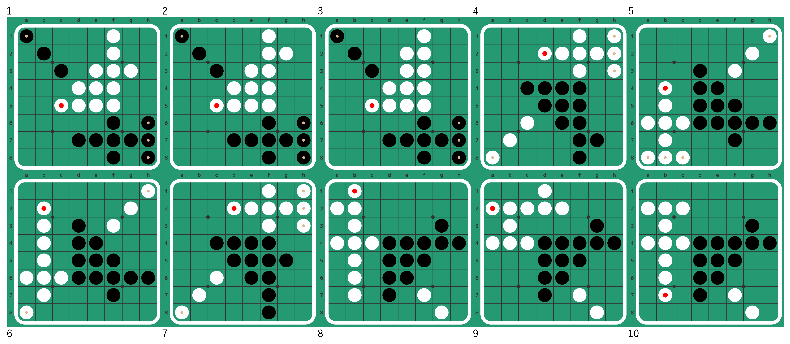

# Shortest_Draw_Othello
Find the shortest Draw in Othello

Article in Japanese: https://qiita.com/Nyanyan_Cube/items/ccab30af5c6a2b9d1e06


## Result

The shortest draw is 20 moves. There are 185 transcripts for 10 final forms.

Example for each final form:

```
f5f4c3f6g7f7f3h7f8b2h6e7h8e3d7g3f2f1a1c5
f5f4c3f6g7f7f3h7f8b2h6e7h8e3d7g2f2f1a1c5
f5f4c3f6g7f7f3h7f8b2h6e3a1e7f2f1h8e2d7c5
f5f6e6f4g7c6f3g2f2f7b7a8h2f1f8h3e2h1c4d2
f5d6c6b6b7f6b5a6e6a8b8f3f7g6g2c8h6h1d3b4
f5d6c6b6b7f6b5a6f7f3g2b4e6g6b3h1h6a8d3b2
f5f6e6f4g5c6f3g2f2f7b7a8h2f1f8h3e2h1c4d2
f5f4g3e6c4b3b4g4f7g8b2a2h4b5b6a4d7b7d6b1
f5f4g3e6c4b3b4g4b2a4f7c2h4g8d2d1d7e2d6a2
f5f4g3e6c4b3b4g4f7g8b2a2d6b5b6c2h4a4d7b7
```




## License

GPL-3.0

Some files are imported from [Egaroucid](https://www.egaroucid.nyanyan.dev/en/) version [d2a287f89046559b8f21d983ac0928d4c0f814e0](https://github.com/Nyanyan/Egaroucid/tree/d2a287f89046559b8f21d983ac0928d4c0f814e0)


## Full Result

```
depth 2 unique transcript: 0 unique board: 0
depth 4 unique transcript: 0 unique board: 0
depth 6 unique transcript: 0 unique board: 0
depth 8 unique transcript: 0 unique board: 0
depth 10 unique transcript: 0 unique board: 0
depth 12 unique transcript: 0 unique board: 0
depth 14 unique transcript: 0 unique board: 0
depth 16 unique transcript: 0 unique board: 0
depth 18 unique transcript: 0 unique board: 0
depth 20 unique transcript: 185 unique board: 10
X-X-----XXXXX---X-X-------OOOO----OOO----OOO-X----O---X---O----X
f5f4c3f6g7f7f3h7f8b2h6e7h8e3d7g3f2f1a1c5
f5f4c3f6g7f7f3h7f8b2h6e7h8g3d7e3f2f1a1c5
X-X-----XXXXX---X-X-------OOOO----OOO-----OO-X---OO---X---O----X
f5f4c3f6g7f7f3h7f8b2h6e7h8e3d7g2f2f1a1c5
X-X-----XXXXX---X-X-------OOOO----OOO-----OO-X----OO--X---O----X
f5f4c3f6g7f7f3h7f8b2h6e3a1e7f2f1h8e2d7c5
--X----O-XX---O---XX-O----XXX-----XXXX--O-O-----OOOOO---O-O-----
f5f6e6f4g7c6f3g2f2f7b7a8h2f1f8h3e2h1c4d2
f5f6e6f4g7c6f3g2f2f7h2f1b7h3e2h1f8a8c4d2
f5f6e6f4g7c6f3g2f2f7b7a8h2h1f8f1e2h3c4d2
f5f6e6f4g7c6f3g2f2f7h2f1e2h1f8d2b7a8c4h3
f5f6e6f4g7c6f3g2f2f7h2f1e2h3f8d2b7a8c4h1
f5f6e6f4g7c6f3g2f2f7h2f1e2h3f8h1b7a8c4d2
f5f6e6f4g7c6f3g2f2f7h2f1e2h1f8h3b7a8c4d2
f5f6e6f4g7c6f3g2f2f7b7a8h2f1e2h3f8d2c4h1
f5f6e6f4g7c6f3g2f2f7h2f1b7h3f8a8e2h1c4d2
f5f6e6f4g7c6f3g2f2f7b7a8h2f1f8h1e2h3c4d2
f5f6e6f4g7c6f3g2f2f7b7a8h2f1e2h3f8h1c4d2
f5f6e6f4g7c6f3g2f2f7b7a8h2f1e2h1f8h3c4d2
f5f6e6f4g7c6f3g2f2f7b7a8h2f1e2h1f8d2c4h3
f5f6e6d6g7f3c6b7b6g6b8a6b5c8h6a8g2h1d3b4
f5f6e6d6g7f3c6b7b6g6b8a6b5c8h6b4g2h1d3a8
f5f6e6d6g7f3c6b7b6g6b8a6b5a8h6b4g2h1d3c8
f5f6e6d6g7f3c6b7b6g6b8a6g2c8b5a8h6h1d3b4
f5d6c6b6b7f6b5a6e6a8b8f3g7g6g2c8h6h1d3b4
f5f6e6d6g7f3c6b7b6g6b8a6b5a8h6c8g2h1d3b4
f5f6e6d6g7f3c6b7b6g6g2h1b8a8h6a6b5c8d3b4
f5d6c6b6b7f6b5a6e6f3g7g6g2c8b8a8h6h1d3b4
f5f6e6d6g7f3c6b7b6g6b8a6g2c8h6h1b5a8d3b4
f5d6c6b6b7f6b5a6e6f3g7g6g2c8h6h1b8a8d3b4
f5f6e6d6g7f3c6b7b6g6g2h1b8a6h6c8b5a8d3b4
f5d6c6b6b7f6b5a6e6c8g7g6b8f3g2a8h6h1d3b4
f5d6c6b6b7f6b5a6e6a8g7f3b8g6g2c8h6h1d3b4
f5f6e6d6g7f3c6b7b6g6g2h1b8a6h6a8b5c8d3b4
f5d6c6b6b7f6b5a6e6f3g2c8g7h1b8g6h6a8d3b4
f5f6e6d6g7f3c6b7b6g6g2h1b8a6b5c8h6a8d3b4
f5d6c6b6b7f6b5a6e6a8b8f3g7g6h6c8g2h1d3b4
f5f6e6d6g7f3c6b7b6g6g2h1b8a6b5c8h6b4d3a8
f5d6c6b6b7f6b5a6e6a8b8f3g2c8g7g6h6h1d3b4
f5d6c6b6b7f6b5a6e6a8g7g6b8f3g2c8h6h1d3b4
f5d6c6b6b7f6b5a6e6f3g2c8b8a8g7g6h6h1d3b4
f5f6e6d6g7f3c6b7b6g6g2h1b8a6b5a8h6c8d3b4
f5d6c6b6b7f6b5a6e6f3g7a8b8g6h6c8g2h1d3b4
f5f6e6d6g7f3c6b7b6g6g2h1b8a6b5a8h6b4d3c8
f5d6c6b6b7f6b5a6e6c8b8f3g7g6g2a8h6h1d3b4
f5d6c6b6b7f6b5a6e6f3g2c8g7g6b8a8h6h1d3b4
f5d6c6b6b7f6b5a6e6c8b8f3g2a8g7g6h6h1d3b4
f5d6c6b6b7f6b5a6e6f3g2c8g7g6h6h1b8a8d3b4
f5d6c6b6b7f6b5a6e6c8g7f3b8g6g2a8h6h1d3b4
f5d6c6b6b7f6b5a6e6a8g7g6b8f3h6c8g2h1d3b4
f5d6c6b6b7f6b5a6e6a8g7f3b8g6h6c8g2h1d3b4
f5d6c6b6b7f6b5a6e6f3g7c8b8g6g2a8h6h1d3b4
f5d6c6b6b7f6b5a6e6f3g7a8b8g6g2c8h6h1d3b4
-----OOO--X---O-XXXXXOOO--XXX-O----XX-O---O-X----O------O-------
f5d6c6b6b7f6b5a6e6a8b8f3f7g6g2c8h6h1d3b4
f5f6f7d6e6f3c6b7b6g6b8a6g2c8h6h1b5a8d3b4
f5d6c6b6b7f6b5a6e6c8b8f3f7g6g2a8h6h1d3b4
f5f6e6f4g6c6f3g2f2f7b7a8h2f1e2h3f8d2c4h1
f5d6c6b6b7f6b5a6f7f3g2c8e6g6b8a8h6h1d3b4
f5f6e6f4g6c6f3g2f2f7b7a8h2f1f8h3e2h1c4d2
f5d6c6b6b7f6b5a6f7a8e6f3b8g6h6c8g2h1d3b4
f5f6e6f4g6c6f3g2f2f7h2f1e2h1f8d2b7a8c4h3
f5f6e6d6f7f3c6b7b6g6g2h1b8a6b5c8h6b4d3a8
f5d6c6b6b7f6b5a6e6f3f7g6g2c8b8a8h6h1d3b4
f5f6e6d6f7f3c6b7b6g6b8a6b5c8h6a8g2h1d3b4
f5d6c6b6b7f6b5a6f7a8e6g6b8f3h6c8g2h1d3b4
f5f6f7d6e6f3c6b7b6g6g2h1b8a6b5a8h6b4d3c8
f5d6c6b6b7f6b5a6f7c8e6f3b8g6g2a8h6h1d3b4
f5f6e6f4g6c6f3g2f2f7h2f1e2h1f8h3b7a8c4d2
f5f6e6f4g6c6f3g2f2f7b7a8h2h1f8f1e2h3c4d2
f5f6f7d6e6f3c6b7b6g6g2h1b8a6h6a8b5c8d3b4
f5d6c6b6b7f6b5a6e6c8f7f3b8g6g2a8h6h1d3b4
f5f6e6d6f7f3c6b7b6g6g2h1b8a6h6c8b5a8d3b4
f5f6e6f4g6c6f3g2f2f7h2f1b7h3e2h1f8a8c4d2
f5d6c6b6b7f6b5a6e6f3f7a8b8g6g2c8h6h1d3b4
f5d6c6b6b7f6b5a6f7f3g2c8e6g6b8h1h6a8d3b4
f5f6e6f4g6c6f3g2f2f7h2f1e2h3f8d2b7a8c4h1
f5f6e6d6f7f3c6b7b6g6g2h1b8a8h6a6b5c8d3b4
f5f6e6d6f7f3c6b7b6g6b8a6b5a8h6c8g2h1d3b4
f5f6e6f4g6c6f3g2f2f7h2f1e2h3f8h1b7a8c4d2
f5f6f7d6e6f3c6b7b6g6g2h1b8a6b5a8h6c8d3b4
f5f6f7d6e6f3c6b7b6g6g2h1b8a6b5c8h6a8d3b4
f5d6c6b6b7f6b5a6e6f3f7g6g2c8h6h1b8a8d3b4
f5f6e6d6f7f3c6b7b6g6b8a6g2c8h6h1b5a8d3b4
f5d6c6b6b7f6b5a6f7a8e6f3b8g6g2c8h6h1d3b4
f5f6e6f4g6c6f3g2f2f7h2f1b7h3f8a8e2h1c4d2
f5d6c6b6b7f6b5a6e6a8b8f3f7g6h6c8g2h1d3b4
f5f6e6d6f7f3c6b7b6g6g2h1b8a6h6a8b5c8d3b4
f5f6e6f4g6c6f3g2f2f7b7a8h2f1f8h1e2h3c4d2
f5f6e6f4g6c6f3g2f2f7b7a8h2f1e2h3f8h1c4d2
f5d6c6b6b7f6b5a6e6f3f7a8b8g6h6c8g2h1d3b4
f5f6f7d6e6f3c6b7b6g6g2h1b8a8h6a6b5c8d3b4
f5f6e6f4g6c6f3g2f2f7b7a8h2f1e2h1f8d2c4h3
f5f6f7d6e6f3c6b7b6g6b8a6b5c8h6b4g2h1d3a8
f5d6c6b6b7f6b5a6e6a8f7g6b8f3h6c8g2h1d3b4
f5d6c6b6b7f6b5a6e6f3g2c8b8a8f7g6h6h1d3b4
f5d6c6b6b7f6b5a6e6a8b8f3g2c8f7g6h6h1d3b4
f5d6c6b6b7f6b5a6f7a8e6g6b8f3g2c8h6h1d3b4
f5f6e6f4g6c6f3g2f2f7b7a8h2f1e2h1f8h3c4d2
f5f6f7d6e6f3c6b7b6g6b8a6g2c8b5a8h6h1d3b4
f5f6f7d6e6f3c6b7b6g6b8a6b5a8h6c8g2h1d3b4
f5f6f7d6e6f3c6b7b6g6b8a6b5c8h6a8g2h1d3b4
f5d6c6b6b7f6b5a6e6a8f7f3b8g6h6c8g2h1d3b4
f5f6f7d6e6f3c6b7b6g6b8a6b5a8h6b4g2h1d3c8
f5f6f7d6e6f3c6b7b6g6g2h1b8a6h6c8b5a8d3b4
f5f6f7d6e6f3c6b7b6g6g2h1b8a6b5c8h6b4d3a8
f5d6c6b6b7f6b5a6e6c8f7g6b8f3g2a8h6h1d3b4
f5f6e6d6f7f3c6b7b6g6b8a6b5c8h6b4g2h1d3a8
f5f6e6d6f7f3c6b7b6g6b8a6g2c8b5a8h6h1d3b4
f5d6c6b6b7f6b5a6e6f3f7c8b8g6g2a8h6h1d3b4
f5d6c6b6b7f6b5a6e6c8b8f3g2a8f7g6h6h1d3b4
f5d6c6b6b7f6b5a6e6a8f7f3b8g6g2c8h6h1d3b4
f5f6e6d6f7f3c6b7b6g6b8a6b5a8h6b4g2h1d3c8
f5d6c6b6b7f6b5a6f7f3g2c8e6h1b8g6h6a8d3b4
f5f6e6d6f7f3c6b7b6g6g2h1b8a6b5a8h6b4d3c8
f5f6e6d6f7f3c6b7b6g6g2h1b8a6b5a8h6c8d3b4
f5f6e6d6f7f3c6b7b6g6g2h1b8a6b5c8h6a8d3b4
f5d6c6b6b7f6b5a6e6a8f7g6b8f3g2c8h6h1d3b4
f5d6c6b6b7f6b5a6f7c8e6g6b8f3g2a8h6h1d3b4
f5d6c6b6b7f6b5a6e6f3g2c8f7g6b8a8h6h1d3b4
f5d6c6b6b7f6b5a6e6f3g2c8f7g6h6h1b8a8d3b4
f5d6c6b6b7f6b5a6e6f3g2c8f7h1b8g6h6a8d3b4
-------O--X---O-XXXXXOOO--XXX-O----XX-O---O-X-O--O----O-O-------
f5d6c6b6b7f6b5a6f7f3g2b4e6g6b3h1h6a8d3b2
f5d6c6b6b7f6b5a6f7f3g2b4e6g6b3a8h6h1d3b2
--X----O--X---O---XX-O---XXXX-----XXXX--O-O-----OOOOO---O-O-----
f5f6e6f4g5c6f3g2f2f7b7a8h2f1f8h3e2h1c4d2
f5f6e6f4g5c6f3g2f2f7b7a8h2h1f8f1e2h3c4d2
f5f6e6f4g5c6f3g2f2f7h2f1b7h3e2h1f8a8c4d2
f5f6e6f4g5c6f3g2f2f7h2f1e2h1f8d2b7a8c4h3
f5f6e6f4g5c6f3g2f2f7h2f1e2h1f8h3b7a8c4d2
f5f6e6f4g5c6f3g2f2f7h2f1e2h3f8h1b7a8c4d2
f5f6e6f4g5c6f3g2f2f7h2f1e2h3f8d2b7a8c4h1
f5f6e6f4g5c6f3g2f2f7b7a8h2f1e2h3f8d2c4h1
f5f6e6f4g5c6f3g2f2f7h2f1b7h3f8a8e2h1c4d2
f5f6e6f4g5c6f3g2f2f7b7a8h2f1f8h1e2h3c4d2
f5f6e6f4g5c6f3g2f2f7b7a8h2f1e2h1f8d2c4h3
f5f6e6f4g5c6f3g2f2f7b7a8h2f1e2h3f8h1c4d2
f5f6e6f4g5c6f3g2f2f7b7a8h2f1e2h1f8h3c4d2
f5f6e6d6e7f3c6b7b6g6b8a6b5c8h6a8g2h1d3b4
f5f6e6d6e7f3c6b7b6g6b8a6b5c8h6b4g2h1d3a8
f5f6e6d6e7f3c6b7b6g6b8a6b5a8h6c8g2h1d3b4
f5f6e6d6e7f3c6b7b6g6b8a6b5a8h6b4g2h1d3c8
f5f6e6d6e7f3c6b7b6g6g2h1b8a8h6a6b5c8d3b4
f5f6e6d6e7f3c6b7b6g6g2h1b8a6h6c8b5a8d3b4
f5f6e6d6e7f3c6b7b6g6b8a6g2c8h6h1b5a8d3b4
f5f6e6d6e7f3c6b7b6g6b8a6g2c8b5a8h6h1d3b4
f5f6e6d6e7f3c6b7b6g6g2h1b8a6b5c8h6b4d3a8
f5f6e6d6e7f3c6b7b6g6g2h1b8a6h6a8b5c8d3b4
f5f6e6d6e7f3c6b7b6g6g2h1b8a6b5c8h6a8d3b4
f5f6e6d6e7f3c6b7b6g6g2h1b8a6b5a8h6c8d3b4
f5f6e6d6e7f3c6b7b6g6g2h1b8a6b5a8h6b4d3c8
-O--------O-X-O----XX-O---XXX-O-XXXXXOOO-X----O-------OO------O-
f5f4g3e6c4b3b4g4f7g8b2a2h4b5b6a4d7b7d6b1
f5f4g3e6c4b3b4g4b2a2h4b5b6a4f7g8d6b7d7b1
f5f4g3e6c4b3b4g4f7g8b2a2h4b5b6a4d7b1d6b7
f5f4g3e6c4b3b4g4b2a2h4b5b6a4f7g8d6b1d7b7
f5f4g3e6c4b3b4g4f7g8b2a2h4b5b6a4d6b7d7b1
f5f4g3e6c4b3b4g4f7g8b2a2h4b5b6a4d6b1d7b7
f5f4g3e6c4b3b4g4b2a2h4b5b6a4f7g8d7b7d6b1
f5f4g3e6c4b3b4g4b2a2h4b5b6a4f7g8d7b1d6b7
f5f4g3e6c4b3b4g4f7g8b2a2d6b5b6a4h4b1d7b7
f5f4g3e6c4b3b4g4f7g8b2a2d6b5b6a4h4b7d7b1
-O--------O-X------XX-----XXX---XXXXXOOO-X----O----OOOOO----O---
f5f4g3e6c4b3b4g4b2a4f7c2h4g8d2d1d7e2d6a2
f5f4g3e6c4b3b4g4b2a4f7c2d2d1h4g8d6e2d7a2
f5f4g3e6c4b3b4g4f7g8b2a4h4c2d2d1d6e2d7a2
f5f4g3e6c4b3b4g4b2a4f7c2h4g8d2d1d7a2d6e2
f5f4g3e6c4b3b4g4b2a4f7c2d2d1h4g8d6a2d7e2
f5f4g3e6c4b3b4g4f7g8b2a4h4c2d2d1d6a2d7e2
f5f4g3e6c4b3b4g4b2a4f7c2h4g8d2d1d6e2d7a2
f5f4g3e6c4b3b4g4f7g8b2a4d6c2d2d1h4a2d7e2
f5f4g3e6c4b3b4g4b2a4f7c2h4g8d2d1d6a2d7e2
f5f4g3e6c4b3b4g4f7g8b2a4d6c2d2d1h4e2d7a2
f5f4g3e6c4b3b4g4b2a4f7c2d2d1h4g8d7e2d6a2
f5f4g3e6c4b3b4g4f7g8b2a4h4c2d2d1d7e2d6a2
f5f4g3e6c4b3b4g4b2a4f7c2d2d1h4g8d7a2d6e2
f5f4g3e6c4b3b4g4f7g8b2a4h4c2d2d1d7a2d6e2
-O--------O-X-O----XX-O---XXX-O-XXXXXOOO-X----O------OOO--------
f5f4g3e6c4b3b4g4f7g8b2a2d6b5b6c2h4a4d7b7
f5f4g3e6c4b3b4g4f7g8b2a2h4b5b6c2d7a4d6b7
f5f4g3e6c4b3b4g4f7g8b2a2h4b5b6a4d7b7d6c2
f5f4g3e6c4b3b4g4f7g8b2a2h4b5b6a4d7c2d6b7
f5f4g3e6c4b3b4g4b2a2h4b5b6a4f7g8d6b7d7c2
f5f4g3e6c4b3b4g4b2a2h4b5b6c2f7g8d6a4d7b7
f5f4g3e6c4b3b4g4f7g8b2a2d6b5b6a4h4c2d7b7
f5f4g3e6c4b3b4g4f7g8b2a2h4b5b6c2d6a4d7b7
f5f4g3e6c4b3b4g4b2a2h4b5b6a4f7g8d7b7d6c2
f5f4g3e6c4b3b4g4b2a2h4b5b6a4f7g8d7c2d6b7
f5f4g3e6c4b3b4g4b2a2h4b5b6a4f7g8d6c2d7b7
f5f4g3e6c4b3b4g4b2a2h4b5b6c2f7g8d7a4d6b7
f5f4g3e6c4b3b4g4f7g8b2a2d6b5b6a4h4b7d7c2
f5f4g3e6c4b3b4g4f7g8b2a2h4b5b6a4d6c2d7b7
f5f4g3e6c4b3b4g4f7g8b2a2h4b5b6a4d6b7d7c2

```

