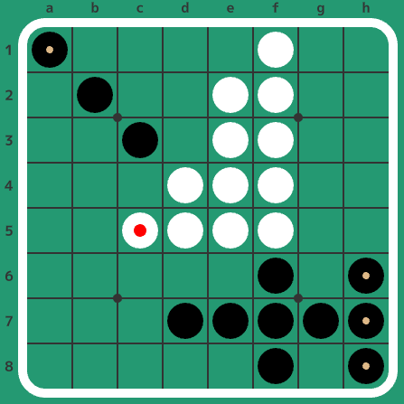

# Shortest_Draw_Othello
Find the shortest Draw in Othello


## Result

The shortest draw is 20 moves. There are 4 solutions and 2 final forms:

```
f5f4c3f6g7f7f3h7f8b2h6e7h8g3d7e3f2f1a1c5
f5f4c3f6g7f7f3h7f8b2h6e7h8e3d7g3f2f1a1c5
f5f4c3f6g7f7f3h7f8b2h6e7h8e3d7g2f2f1a1c5
f5f4c3f6g7f7f3h7f8b2h6e3a1e7f2f1h8e2d7c5
```

The first 3 solutions lead this:


The final solution leads this:




```
depth 2 start
depth 2 n_silhouettes 0 n_boards 0 n_solutions 0 time 1 ms
depth 4 start
depth 4 n_silhouettes 1 n_boards 0 n_solutions 0 time 2 ms
depth 6 start
depth 6 n_silhouettes 105 n_boards 6 n_solutions 0 time 3 ms
depth 8 start
depth 8 n_silhouettes 3971 n_boards 38 n_solutions 0 time 6 ms
depth 10 start
depth 10 n_silhouettes 92666 n_boards 343 n_solutions 0 time 39 ms
depth 12 start
depth 12 n_silhouettes 1560899 n_boards 3061 n_solutions 0 time 1087 ms
depth 14 start
depth 14 n_silhouettes 20368858 n_boards 29339 n_solutions 0 time 21257 ms
depth 16 start
depth 16 n_silhouettes 214038538 n_boards 248067 n_solutions 0 time 308510 ms
depth 18 start
depth 18 n_silhouettes 1886661717 n_boards 1614275 n_solutions 0 time 4692785 ms
depth 20 start
task 0/12
e6d6c3f6g7g6c6g8h6b2f8g5h8c7g4c5b6a6a1e3
e6d6c3f6g7g6c6g8h6b2f8g5h8c5g4c7b6a6a1e3
e6d6c3f6g7g6c6g8h6b2f8g5h8c5g4b7b6a6a1e3
e6d6c3f6g7g6c6g8h6b2f8c5a1g5b6a6h8b5g4e3
e6d6c3f6g7g6c6g8h6b2f8g5h8c7g4c5b6a6a1e3
e6d6c3f6g7g6c6g8h6b2f8g5h8c5g4c7b6a6a1e3
e6d6c3f6g7g6c6g8h6b2f8g5h8c5g4b7b6a6a1e3
e6d6c3f6g7g6c6g8h6b2f8c5a1g5b6a6h8b5g4e3
depth 20 n_silhouettes 14946317845 n_boards 9742799 n_solutions 8 time 51763111 ms
```


## License

GPL-3.0

Some files are imported from [Egaroucid](https://www.egaroucid.nyanyan.dev/en/) version [d2a287f89046559b8f21d983ac0928d4c0f814e0](https://github.com/Nyanyan/Egaroucid/tree/d2a287f89046559b8f21d983ac0928d4c0f814e0)
